<div align="center">
  
</div>

<br/>
<br/>

```
  Full-stack developer building fast, precise web applications.
  Focused on clean architecture, performance, and code that scales.
```

<br/>

**Frontend**  &nbsp;·&nbsp; React &nbsp;·&nbsp; Next.js &nbsp;·&nbsp; TypeScript &nbsp;·&nbsp; HTML &nbsp;·&nbsp; CSS

**Backend**   &nbsp;·&nbsp; Node.js &nbsp;·&nbsp; Python &nbsp;·&nbsp; REST &nbsp;·&nbsp; PostgreSQL

**Tooling**   &nbsp;·&nbsp; Git &nbsp;·&nbsp; Docker &nbsp;·&nbsp; Linux &nbsp;·&nbsp; Vite

<br/>

---

<br/>

> Currently open to collaboration and interesting problems.  
> [github.com/BahyTheDev](https://github.com/BahyTheDev)

<br/>
<br/>

<div align="right">
  <sub><sup>Handcrafted · No templates</sup></sub>
</div>
